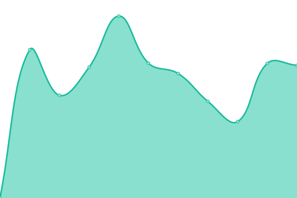
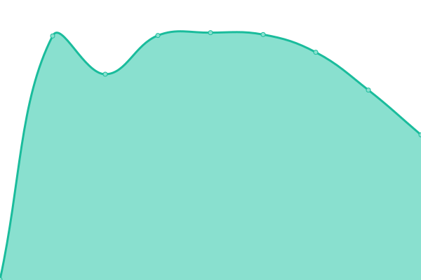
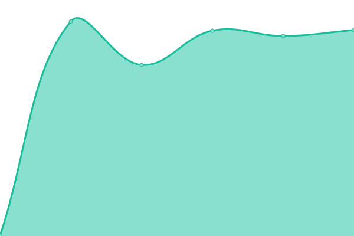
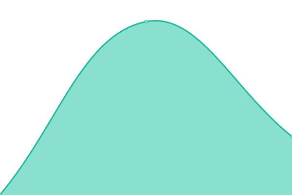

# [📈 Live Status](https://demo.upptime.js.org): <!--live status--> **🟧 Partial outage**

This repository contains the open-source uptime monitor and status page for [Guttorm](https://ndla.no), powered by [Upptime](https://github.com/upptime/upptime).

With [Upptime](https://upptime.js.org), you can get your own unlimited and free uptime monitor and status page, powered entirely by a GitHub repository. We use [Issues](https://github.com/ghveem/oppetid/issues) as incident reports, [Actions](https://github.com/ghveem/oppetid/actions) as uptime monitors, and [Pages](https://demo.upptime.js.org) for the status page.

<!--start: status pages-->
<!-- This summary is generated by Upptime (https://github.com/upptime/upptime) -->
<!-- Do not edit this manually, your changes will be overwritten -->
<!-- prettier-ignore -->
| URL | Status | History | Response Time | Uptime |
| --- | ------ | ------- | ------------- | ------ |
|  [NDLA](https://ndla.no) | 🟩 Up | [ndla.yml](https://github.com/ghveem/oppetid/commits/HEAD/history/ndla.yml) | 

 1048ms
     
 | 

<a href="https://demo.upptime.js.org/history/ndla">100.00%</a>
    

|  [NDLA API](https://api.ndla.no) | 🟩 Up | [ndla-api.yml](https://github.com/ghveem/oppetid/commits/HEAD/history/ndla-api.yml) | 

 523ms
     
 | 

<a href="https://demo.upptime.js.org/history/ndla-api">100.00%</a>
    

|  [NDLA H5P](https://ca.h5p.ndla.no/h5p) | 🟩 Up | [ndla-h5-p.yml](https://github.com/ghveem/oppetid/commits/HEAD/history/ndla-h5-p.yml) | 

 727ms
     
 | 

<a href="https://demo.upptime.js.org/history/ndla-h5-p">100.00%</a>
    

|  [NDLA Support](https://ndla.zendesk.com) | 🟥 Down | [ndla-support.yml](https://github.com/ghveem/oppetid/commits/HEAD/history/ndla-support.yml) | 

 751ms
     
 | 

<a href="https://demo.upptime.js.org/history/ndla-support">29.73%</a>
    

|  [Udir.no](https://udir.no) | 🟩 Up | [udir-no.yml](https://github.com/ghveem/oppetid/commits/HEAD/history/udir-no.yml) | 

 2259ms
     
 | 

<a href="https://demo.upptime.js.org/history/udir-no">100.00%</a>
    

|  [GREP](https://data.udir.no/kl06/v201906/status/status_publisert) | 🟩 Up | [grep.yml](https://github.com/ghveem/oppetid/commits/HEAD/history/grep.yml) | 

 948ms
     
 | 

<a href="https://demo.upptime.js.org/history/grep">100.00%</a>
    

|  [SNL](https://snl.no) | 🟩 Up | [snl.yml](https://github.com/ghveem/oppetid/commits/HEAD/history/snl.yml) | 

 295ms
     
 | 

<a href="https://demo.upptime.js.org/history/snl">100.00%</a>
    

|  [Google](https://www.google.com) | 🟩 Up | [google.yml](https://github.com/ghveem/oppetid/commits/HEAD/history/google.yml) | 

 74ms
     
 | 

<a href="https://demo.upptime.js.org/history/google">100.00%</a>
    

|  [Wikipedia](https://en.wikipedia.org) | 🟩 Up | [wikipedia.yml](https://github.com/ghveem/oppetid/commits/HEAD/history/wikipedia.yml) | 

 711ms
     
 | 

<a href="https://demo.upptime.js.org/history/wikipedia">100.00%</a>
    

<!--end: status pages-->

[**Visit our status website →**](https://demo.upptime.js.org)

## 📄 License

- Powered by: [Upptime](https://github.com/upptime/upptime)
- Code: [MIT](./LICENSE) © [Guttorm](https://ndla.no)
- Data in the `./history` directory: [Open Database License](https://opendatacommons.org/licenses/odbl/1-0/)
