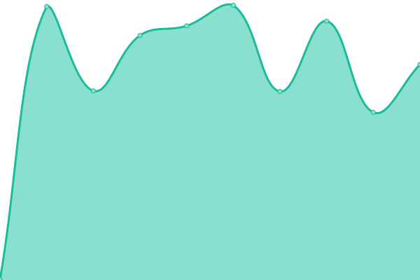
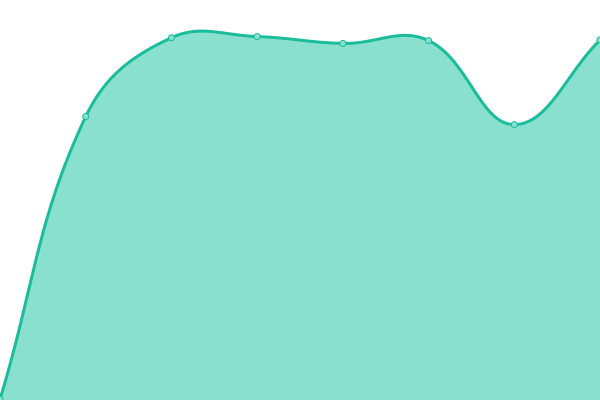
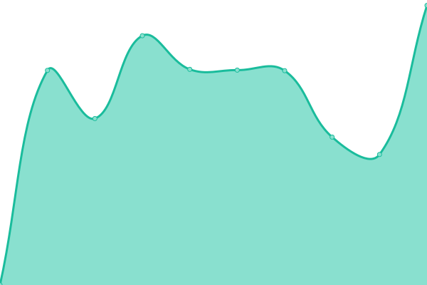
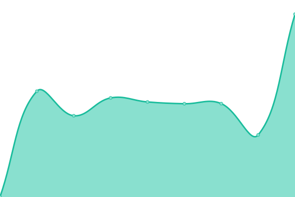
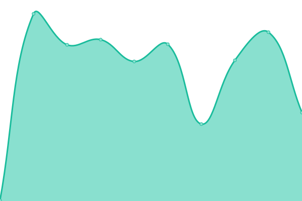
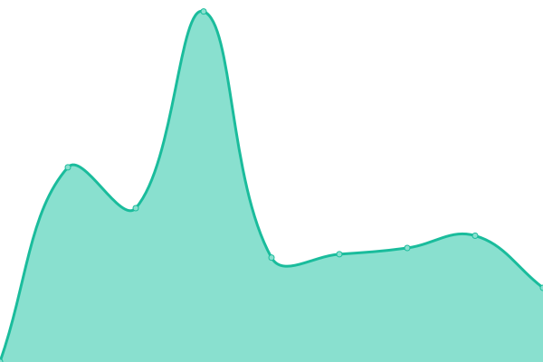

# [📈 Live Status](https://demo.upptime.js.org): <!--live status--> **🟧 Partial outage**

This repository contains the open-source uptime monitor and status page for [Guttorm](https://ndla.no), powered by [Upptime](https://github.com/upptime/upptime).

With [Upptime](https://upptime.js.org), you can get your own unlimited and free uptime monitor and status page, powered entirely by a GitHub repository. We use [Issues](https://github.com/ghveem/oppetid/issues) as incident reports, [Actions](https://github.com/ghveem/oppetid/actions) as uptime monitors, and [Pages](https://ghveem.github.io/oppetid/) for the status page.

<!--start: status pages-->
<!-- This summary is generated by Upptime (https://github.com/upptime/upptime) -->
<!-- Do not edit this manually, your changes will be overwritten -->
<!-- prettier-ignore -->
| URL | Status | History | Response Time | Uptime |
| --- | ------ | ------- | ------------- | ------ |
|  [NDLA.no](https://ndla.no) | Oppe | [ndla-no.yml](https://github.com/ghveem/oppetid/commits/HEAD/history/ndla-no.yml) | 

 982ms
     
 | 

<a href="https://ghveem.github.io/oppetid/history/ndla-no">100.00%</a>
    

|  [api.NDLA.no](https://api.ndla.no) | Oppe | [api-ndla-no.yml](https://github.com/ghveem/oppetid/commits/HEAD/history/api-ndla-no.yml) | 

 530ms
     
 | 

<a href="https://ghveem.github.io/oppetid/history/api-ndla-no">100.00%</a>
    

|  [stier.ndla.no](https://stier.ndla.no) | Oppe | [stier-ndla-no.yml](https://github.com/ghveem/oppetid/commits/HEAD/history/stier-ndla-no.yml) | 

 600ms
     
 | 

<a href="https://ghveem.github.io/oppetid/history/stier-ndla-no">100.00%</a>
    

|  [h5p.ndla.no](https://ca.h5p.ndla.no/h5p) | Oppe | [h5p-ndla-no.yml](https://github.com/ghveem/oppetid/commits/HEAD/history/h5p-ndla-no.yml) | 

 671ms
     
 | 

<a href="https://ghveem.github.io/oppetid/history/h5p-ndla-no">100.00%</a>
    

|  [auth.h5p.ndla.no](https://auth.h5p.ndla.no/) | Oppe | [auth-h5p-ndla-no.yml](https://github.com/ghveem/oppetid/commits/HEAD/history/auth-h5p-ndla-no.yml) | 

 796ms
     
 | 

<a href="https://ghveem.github.io/oppetid/history/auth-h5p-ndla-no">100.00%</a>
    

|  [testvarsel](https://test.testesen.no) | Nede | [testvarsel.yml](https://github.com/ghveem/oppetid/commits/HEAD/history/testvarsel.yml) | 

 0ms
     
 | 

<a href="https://ghveem.github.io/oppetid/history/testvarsel">7.22%</a>
    

|  [ed.ndla.no](https://ed.ndla.no) | Oppe | [ed-ndla-no.yml](https://github.com/ghveem/oppetid/commits/HEAD/history/ed-ndla-no.yml) | 

 584ms
     
 | 

<a href="https://ghveem.github.io/oppetid/history/ed-ndla-no">100.00%</a>
    

|  [NDLA Support](https://ndla.zendesk.com/) | Oppe | [ndla-support.yml](https://github.com/ghveem/oppetid/commits/HEAD/history/ndla-support.yml) | 

 854ms
     
 | 

<a href="https://ghveem.github.io/oppetid/history/ndla-support">86.06%</a>
    

|  [Udir.no](https://udir.no) | Oppe | [udir-no.yml](https://github.com/ghveem/oppetid/commits/HEAD/history/udir-no.yml) | 

 2121ms
     
 | 

<a href="https://ghveem.github.io/oppetid/history/udir-no">100.00%</a>
    

|  [GREP](https://data.udir.no/kl06/v201906/status/status_publisert) | Oppe | [grep.yml](https://github.com/ghveem/oppetid/commits/HEAD/history/grep.yml) | 

 885ms
     
 | 

<a href="https://ghveem.github.io/oppetid/history/grep">100.00%</a>
    

|  [SNL](https://snl.no) | Oppe | [snl.yml](https://github.com/ghveem/oppetid/commits/HEAD/history/snl.yml) | 

 305ms
     
 | 

<a href="https://ghveem.github.io/oppetid/history/snl">100.00%</a>
    

|  [NRK skole](https://www.nrk.no/skole/) | Oppe | [nrk-skole.yml](https://github.com/ghveem/oppetid/commits/HEAD/history/nrk-skole.yml) | 

 828ms
     
 | 

<a href="https://ghveem.github.io/oppetid/history/nrk-skole">100.00%</a>
    

<!--end: status pages-->

[**Visit our status website →**](https://ghveem.github.io/oppetid/)

## 📄 License

- Powered by: [Upptime](https://github.com/upptime/upptime)
- Code: [MIT](./LICENSE) // [Guttorm](https://github.com/ghveem)
- Data in the `./history` directory: [Open Database License](https://opendatacommons.org/licenses/odbl/1-0/)
