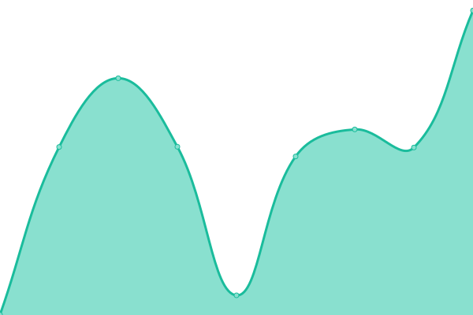
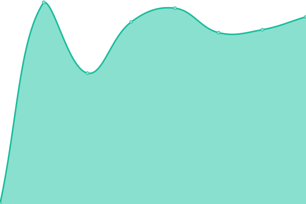
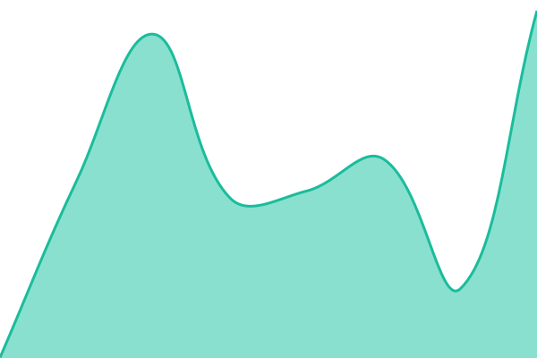
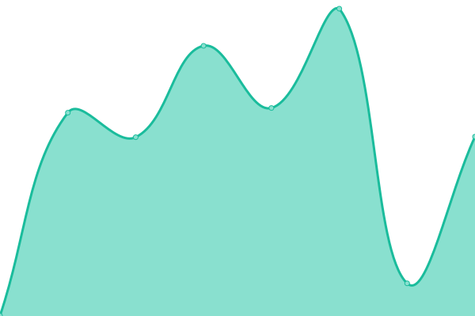
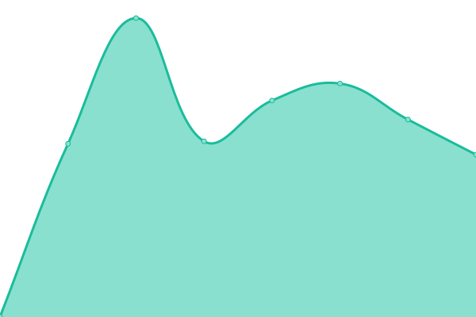
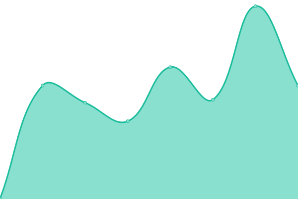

# [📈 Status](https://status.ndla.no): <!--live status--> **🟧 Partial outage**

This repository contains the open-source uptime monitor and status page for [NDLA.no](https://ndla.no), powered by [Upptime](https://github.com/upptime/upptime).

For ndla.no - Dei flesta sakene heng saman, er t.d. api eller taksonomi nede, så påvirkar det resten. Er noko nede her, så har teknikarane fått varsel og jobbar med saka.
Hendingar vert lagra som [Issues](https://github.com/NDLANO/oppetid/issues) med rapportar, [Actions](https://github.com/NDLANO/oppetid/actions) som monitor, og [Pages](https://NDLANO.github.io/oppetid/) som statusside.

<!--start: status pages-->
<!-- This summary is generated by Upptime (https://github.com/upptime/upptime) -->
<!-- Do not edit this manually, your changes will be overwritten -->
<!-- prettier-ignore -->
| URL | Status | History | Response Time | Uptime |
| --- | ------ | ------- | ------------- | ------ |
|  [NDLA.no](https://ndla.no) | Oppe | [ndla-no.yml](https://github.com/NDLANO/oppetid/commits/HEAD/history/ndla-no.yml) | 

 749ms
     
 | 

<a href="https://status.ndla.no/history/ndla-no">100.00%</a>
    

|  [api.NDLA.no](https://api.ndla.no) | Oppe | [api-ndla-no.yml](https://github.com/NDLANO/oppetid/commits/HEAD/history/api-ndla-no.yml) | 

 413ms
     
 | 

<a href="https://status.ndla.no/history/api-ndla-no">100.00%</a>
    

|  [ndla-ki.no](http://ndla-ki.no/) | Nede | [ndla-ki-no.yml](https://github.com/NDLANO/oppetid/commits/HEAD/history/ndla-ki-no.yml) | 

 2004ms
     
 | 

<a href="https://status.ndla.no/history/ndla-ki-no">99.25%</a>
    

|  [arena.ndla.no](https://arena.ndla.no) | Oppe | [arena-ndla-no.yml](https://github.com/NDLANO/oppetid/commits/HEAD/history/arena-ndla-no.yml) | 

 940ms
     
 | 

<a href="https://status.ndla.no/history/arena-ndla-no">100.00%</a>
    

|  [Taksonomi](https://api.ndla.no/taxonomy/api-docs) | Oppe | [taksonomi.yml](https://github.com/NDLANO/oppetid/commits/HEAD/history/taksonomi.yml) | 

 639ms
     
 | 

<a href="https://status.ndla.no/history/taksonomi">100.00%</a>
    

|  [hub.h5p.ndla.no](https://hub.h5p.ndla.no) | Oppe | [hub-h5p-ndla-no.yml](https://github.com/NDLANO/oppetid/commits/HEAD/history/hub-h5p-ndla-no.yml) | 

 808ms
     
 | 

<a href="https://status.ndla.no/history/hub-h5p-ndla-no">100.00%</a>
    

|  ed (NDLA) | Oppe | [ed-ndla.yml](https://github.com/NDLANO/oppetid/commits/HEAD/history/ed-ndla.yml) | 

 549ms
     
 | 

<a href="https://status.ndla.no/history/ed-ndla">100.00%</a>
    

|  test (NDLA) | Oppe | [test-ndla.yml](https://github.com/NDLANO/oppetid/commits/HEAD/history/test-ndla.yml) | 

 1179ms
     
 | 

<a href="https://status.ndla.no/history/test-ndla">100.00%</a>
    

|  staging (NDLA) | Oppe | [staging-ndla.yml](https://github.com/NDLANO/oppetid/commits/HEAD/history/staging-ndla.yml) | 

 1334ms
     
 | 

<a href="https://status.ndla.no/history/staging-ndla">100.00%</a>
    

|  [Kvalitet](https://kvalitet.ndla.no) | Oppe | [kvalitet.yml](https://github.com/NDLANO/oppetid/commits/HEAD/history/kvalitet.yml) | 

 650ms
     
 | 

<a href="https://status.ndla.no/history/kvalitet">100.00%</a>
    

<!--end: status pages-->

[**Sjå oversikt →**](https://status.ndla.no/)

## 📄 License

- Drifta med: [Upptime](https://github.com/upptime/upptime)
- Kode: [MIT](./LICENSE) // [NDLA.no](https://github.com/NDLANO)
- Data i `./history` : [Open Database License](https://opendatacommons.org/licenses/odbl/1-0/)
